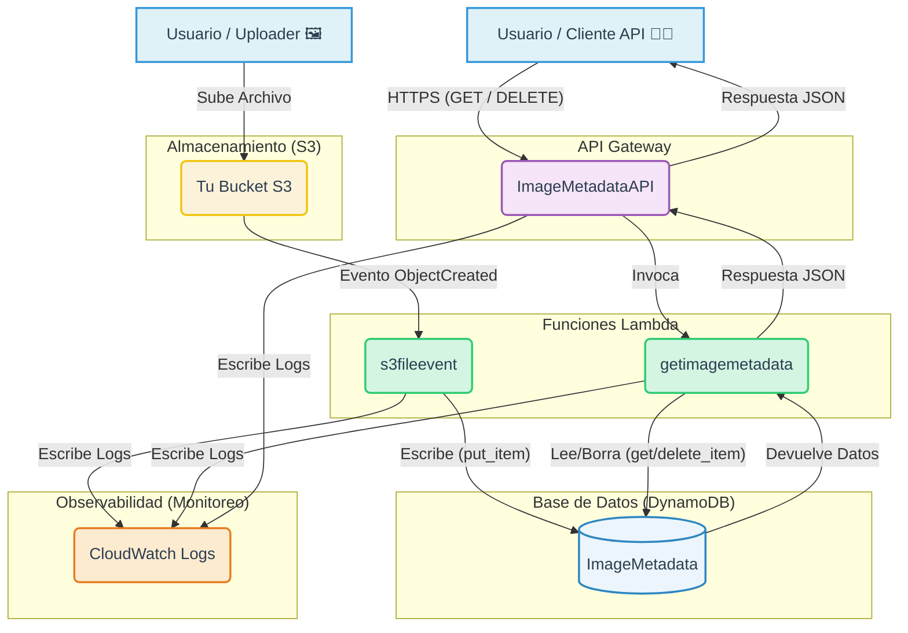

# 🚀 Proyecto: API Serverless de Metadatos de Imágenes

Este proyecto crea un sistema 100% serverless en AWS para registrar automáticamente los metadatos de cualquier imagen subida a un bucket S3. Los metadatos se almacenan en DynamoDB y se exponen a través de una API HTTP para ser consultados o eliminados.

El despliegue del código de las funciones Lambda está completamente automatizado con un pipeline de CI/CD usando GitHub Actions.

## 🏛️ Arquitectura del Sistema

El flujo de datos es el siguiente:
1.  Un usuario sube un archivo (ej: `foto.jpg`) a un **Bucket S3**.
2.  S3 detecta el archivo y **dispara automáticamente** la **Lambda 1 (`s3_file_event`)**.
3.  La Lambda 1 genera un ID único (`fileid`), extrae la metadata (nombre, tamaño, etc.) y la **guarda en DynamoDB**.
4.  Un usuario (o una aplicación) quiere ver los datos y llama a la **API Gateway**.
5.  La API Gateway **dispara la Lambda 2 (`get_image_metadata`)**.
6.  La Lambda 2 **lee o borra** datos de DynamoDB y devuelve la respuesta.

**Flujo Visual:**
`[🖼️ Archivo] ➡️ [AWS S3] ➡️ [Lambda 1] ➡️ [🗂️ DynamoDB] ➡️ [🌐 API Gateway] ➡️ [Lambda 2] ➡️ [🧑‍💻 Usuario]`


### Diagrama de Arquitectura con Mermaid



## ✨ Características

* **Ingesta Automática:** No hay que ejecutar ningún script manual. Solo sube un archivo y la metadata se guarda.
* **Pipeline CI/CD:** El código de las Lambdas se actualiza automáticamente en AWS cada vez que haces `git push` a este repositorio.
* **API HTTP:** Una API simple para `GET` (listar todo), `GET /id` (ver uno) y `DELETE /id` (borrar uno).
* **100% Serverless:** Cero servidores que administrar. Paga solo por lo que usas.

---

## 📋 Requisitos Previos

Antes de empezar, necesitarás:
* **Acceso a una Cuenta de AWS:** Este proyecto está pensado para un entorno de laboratorio (como AWS Academy) donde se proveen credenciales de sesión.
* **Credenciales de Laboratorio:** Necesitarás tus `aws_access_key_id`, `aws_secret_access_key` y `aws_session_token`.
* **Cuenta de GitHub:** Para clonar el repositorio y configurar el pipeline.

---

## 🛠️ Fase 1: Configuración Manual en AWS

El pipeline de GitHub *solo* despliega el código. La infraestructura (base de datos, roles, API) debe crearse manualmente la primera vez.

### 1. Crear Base de Datos (DynamoDB)

1.  Ve al servicio **DynamoDB**.
2.  Haz clic en **"Crear tabla"**.
3.  **Nombre de la tabla:** `ImageMetadata`
4.  **Clave de partición:** `image_id` (deja el tipo como `String`).
5.  Deja el resto por defecto y haz clic en **"Crear tabla"**.

### 2. Crear Almacenamiento (S3)

1.  Ve al servicio **S3**.
2.  Haz clic en **"Crear bucket"**.
3.  **Nombre del bucket:** Elige un nombre único global (ej: `mi-proyecto-lambda-12345`).
4.  **Región:** Asegúrate de que esté en la misma región que tu laboratorio (ej: `us-east-1`).
5.  Deja el resto por defecto y haz clic en **"Crear bucket"**.

### 3. Crear Funciones (Lambda)

Crearemos dos funciones vacías que nuestro pipeline llenará con código.

**Función 1: `s3_file_event` (La que escribe en la BD)**
1.  Ve al servicio **Lambda** -> **"Crear función"**.
2.  Selecciona **"Crear desde cero"**.
3.  **Nombre de la función:** `s3_file_event`
4.  **Runtime:** `Python 3.12` (o el que te provea el laboratorio).
5.  **Rol de ejecución:** Elige "Usar un rol existente" y selecciona el `labrole` que creaste.
6.  Haz clic en "Crear función".

**Función 2: `get_image_metadata` (La que lee desde la API)**
1.  Vuelve a **Lambda** -> **"Crear función"**.
2.  **Nombre de la función:** `get_image_metadata`
3.  **Runtime:** `Python 3.12`.
4.  **Rol de ejecución:** "Usar un rol existente" y selecciona el mismo `labrole`.
5.  Haz clic en "Crear función".

### 5. Configurar Ambas Lambdas

Debes hacer esto para **AMBAS** funciones (`s3_file_event` y `get_image_metadata`).

1.  **Añadir Variable de Entorno:**
    * Ve a la pestaña **"Configuración"**.
    * Clic en **"Variables de entorno"** -> "Editar".
    * Haz clic en **"Añadir variable de entorno"**.
    * **Clave:** `TABLE_NAME`
    * **Valor:** `ImageMetadata` (el nombre de tu tabla).
    * Haz clic en **"Guardar"**.

### 6. Conectar S3 con Lambda 1

1.  Ve a tu **Bucket S3** (el que creaste en el paso 2).
2.  Haz clic en la pestaña **"Propiedades"**.
3.  Baja hasta **"Notificaciones de eventos"** y haz clic en "Crear notificación de eventos".
4.  **Nombre:** `trigger-lambda-s3`
5.  **Tipos de eventos:** Marca la casilla `s3:ObjectCreated:*`.
6.  **Destino:** Elige "Función de Lambda".
7.  **Lambda:** Elige `s3_file_event`.
8.  Haz clic en "Guardar cambios".

### 7. Crear la API (API Gateway)

1.  Ve al servicio **API Gateway**.
2.  Busca el cuadro de **HTTP API** (la azul/verde) y haz clic en **"Crear" (Build)**.
3.  **Integraciones:** Haz clic en "Añadir integración".
    * Elige `Lambda`.
    * Región: `us-east-1` (o tu región).
    * Función de Lambda: `get_image_metadata`
4.  **Nombre de la API:** `ImageMetadataAPI` y haz clic en "Siguiente".
5.  **Configurar Rutas:** Aquí creamos los 3 endpoints.
    * **Ruta 1 (Crear):**
        * Método: `GET`
        * Ruta: `/metadata`
        * Integración: `get_image_metadata`.
    * **Ruta 2 (Crear):**
        * Método: `GET`
        * Ruta: `/metadata/{image_id}` (¡importante usar las llaves!)
        * Integración: `get_image_metadata`.
    * **Ruta 3 (Crear):**
        * Método: `DELETE`
        * Ruta: `/metadata/{image_id}`
        * Integración: `get_image_metadata`.
6.  Haz clic en "Siguiente".
7.  **Etapas:** Deja el `$default` y haz clic en "Siguiente".
8.  Haz clic en **"Crear"**.
9.  Copia la **"URL de invocación"**. ¡La necesitarás para probar!

---

## 🚀 Fase 2: Configuración y Despliegue del Código

Ahora que la infraestructura está lista, conectamos este repositorio.

### 1. Clonar el Repositorio

```bash
git clone [https://github.com/tu-usuario/tu-repositorio.git](https://github.com/tu-usuario/tu-repositorio.git)
cd tu-repositorio

```
2. Configurar los Secretos del Pipeline
El pipeline necesita las credenciales de tu laboratorio para conectarse a AWS.

Ve a tu repositorio en GitHub.

Ve a Settings -> Secrets and variables -> Actions.

Haz clic en "New repository secret" y crea los siguientes tres secretos:

LAB_AWS_ACCESS_KEY_ID (Pega la clave de acceso de tu laboratorio)

LAB_AWS_SECRET_ACCESS_KEY (Pega la clave secreta de tu laboratorio)

LAB_AWS_SESSION_TOKEN (Pega el token de sesión de tu laboratorio)

⚠️ ¡IMPORTANTE! Estas credenciales de laboratorio expiran. Si el pipeline falla con un error Invalid security token, debes volver aquí y pegar las nuevas credenciales de tu sesión de laboratorio.

3. Desplegar
¡Esta es la parte fácil! El archivo .github/workflows/deploy.yml está listo. Simplemente haz un push (o un commit si ya clonaste) a tu rama main o master.


# Haz un pequeño cambio (añade un espacio en este README)
git add .
git commit -m "Despliegue inicial de código Lambda"
git push
Ve a la pestaña "Actions" en GitHub. Verás tu pipeline ejecutarse y ponerse en verde ✅. ¡Tu código ya está en AWS!

🧪 Fase 3: Pruebas del Sistema Completo
Prueba de Escritura (S3 -> Lambda 1 -> DB):

Ve a tu Bucket S3.

Sube un archivo, ej: kuromi.jpg.

Ve a DynamoDB -> ImageMetadata -> Explorar elementos.

Resultado: Deberías ver un nuevo ítem con image_id: "kuromi.jpg" y todos sus metadatos (incluyendo el fileid único).

Prueba de Lectura (API -> Lambda 2 -> DB):

Toma tu URL de invocación de la API.

Listar Todo: Pega esto en tu navegador: {tu-url}/metadata

Obtener Uno: Pega esto en tu navegador: {tu-url}/metadata/kuromi.jpg

Prueba de Borrado (API -> Lambda 2 -> DB):

Abre una terminal.

Ejecuta curl:

Bash

curl -X DELETE "{tu-url}/metadata/kuromi.jpg"
Resultado: Deberías ver el mensaje "Item eliminado".

## Cómo Probar DELETE con Postman
Sigue estos pasos:

Abre Postman.

Elige el método: Al lado de la barra de URL, haz clic en el menú desplegable (que usualmente dice GET) y cámbialo a DELETE.

Pega tu URL: En la barra de URL, pega la dirección completa de tu API, incluyendo el image_id del archivo que quieres borrar.

Ejemplo: https://9gvcgntbvi.execute-api.us-east-1.amazonaws.com/metadata/kuromi.jpg

Envía la solicitud: No necesitas configurar nada más (ni Headers ni Body). Simplemente haz clic en el botón azul "Send".

## Resultados Esperados
1. Respuesta Exitosa
Si funciona, verás la respuesta de tu Lambda en la parte inferior de la pantalla, con un "Status: 200 OK":

JSON
"Item eliminado"

2. Verificación Final
Para confirmar al 100% que se borró:

Vuelve a tu navegador (o a una nueva pestaña en Postman).

Haz un GET a la ruta /metadata (la que lista todo).

Resultado: La lista JSON ahora debería estar vacía [] (o ya no debería incluir el ítem que borraste).

## 🐞 Troubleshooting (Solución de Problemas)
Error: Invalid security token en "Actions"

Causa: Tus credenciales de laboratorio en los Secretos de GitHub expiraron.

Solución: Obtén nuevas credenciales de tu laboratorio y actualiza los 3 secretos LAB_... en GitHub.

Error: KeyError: 'TABLE_NAME' en CloudWatch

Causa: Olvidaste añadir la Variable de Entorno TABLE_NAME a una de tus Lambdas (o no la guardaste).

Solución: Ve a la Configuración de ambas Lambdas y asegúrate de que la variable exista y esté guardada.

Error: ImportModuleError en CloudWatch

Causa: El "Manejador" (Handler) en la Configuración de Runtime de la Lambda está mal.

Solución: Asegúrate de que el Manejador esté configurado como lambda_function.lambda_handler.

Error: {"message": "Not Found"} al usar la API

Causa: Estás llamando a una ruta (ej: /metadata/test.jpg) que no creaste en API Gateway.

Solución: Vuelve al Paso 7 y asegúrate de haber creado las rutas GET /metadata/{image_id} y DELETE /metadata/{image_id}.

